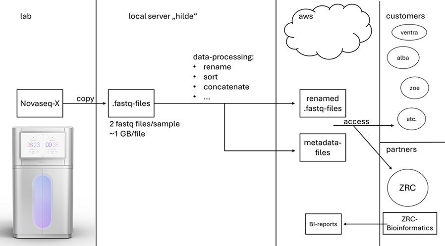

# Handling of Sequencing Data at ZRE

## 1. Overview of ZRE Sequencing Data Workflow

1. After sequencing, data is automatically copied to the local mass storage `\\zymo-filelab01\NovaSeq01\Output`. File format: `.fastq.gz`.
2. Local Linuxserver `zymo-hilde01` is used for data processing and distrubution using [sequencing_data_pipeline](https://github.com/ZRE-Services/sequencing_data_pipeline)
3. Data Processing includes:
    - renaming
    - concatenation
    - sorting
    - metadata-file generation 
5. Rawdata-files and metadata-files are uploaded to aws-cloudstorage S3.
6. Rawdata can be accessed by customers and partners via the aws-cloudstorage S3.
7. ZRC runs bioinformatic analysis on projects that require it and sends BI-reports back to ZRE.
8. ZRE runs bioinformatics analysis on projects that require it.
9. ZRE gives customers access to BI-reports.

Figure 1: Overview of ZRE Sequencing Data Workflow

## 2. Processing a sequencing data batch

1. Within the directory `\\zymo-filelab01\NovaSeq01\Output\sequencing_data_for_upload\` create a new folder.
2. From the directory `\\zymo-filelab01\NovaSeq01\Output\test\wir_automatisieren_den_upload_prozess\shotgun_pipeline_git` copy all files to the new folder you just created (code for data processing and upload is also hosted on Github).
3. Rename the files "YYMMDD_Instructions_&_Checklist.xlsm" and "YYMMDD_Upload_Data_Info.xlsm" according to the date of the sequencing run.
4. Login with the user "upload" on zymo-hilde01 with Remote Desktop control (password required).
5. Follow the instructions within "YYMMDD_Instructions_&_Checklist.xlsm" closely and document each step you completed within this same file.
