# handling_of_sequencing_data

# Data Processing and Data Upload

## 1. Overview of ZRE shotgun data pipeline

1. Samples are sequenced on Novaseq-X and automatically copied to the local storage connected to our Ubuntu-server "hilde" in the form of `.fastq.gz`-files.
2. Data is then renamed, concatenated and sorted. Metadata-files are generated.
3. Renamed `.fastq.gz`-files (rawdata) and metadatafiles are uploaded to aws-cloudstorage.
4. Rawdata can be accessed by customers and partners via the aws-cloudstorage.
5. ZRC runs bioinformatic analysis on projects that require it and sends BI-reports to ZRE.
6. ZRE gives customers access to BI-reports.

### Pipeline Diagram

```mermaid
flowchart LR
    subgraph Lab["Lab"]
        style Lab fill:#f9d6ff,stroke:#333,stroke-width:1px
        Sequencer["Sequencer"]
        style Sequencer fill:#f5f5f5,stroke:#666,color:#333
    end
    
    subgraph LocalServer["Local Server"]
        style LocalServer fill:#d4f4ff,stroke:#333,stroke-width:1px
        FastqFiles[".fastq-files\n2 fastq files/sample\n~1 GB/file"]
        Process["Data-processing:\n- rename\n- sort\n- concatenate\n- ..."]
        style FastqFiles fill:#f5f5f5,stroke:#666,color:#333
        style Process fill:#f5f5f5,stroke:#666,color:#333
    end
    
    subgraph AWSCloud["AWS Cloud"]
        style AWSCloud fill:#fff2cc,stroke:#333,stroke-width:1px
        RenamedFiles["renamed\n.fastq-files"]
        MetadataFiles["metadata-\nfiles"]
        style RenamedFiles fill:#f5f5f5,stroke:#666,color:#333
        style MetadataFiles fill:#f5f5f5,stroke:#666,color:#333
    end
    
    subgraph Customers["Customers"]
        style Customers fill:#d5e8d4,stroke:#333,stroke-width:1px
        Customer1["customer1"]
        Customer2["customer2"]
        style Customer1 fill:#f5f5f5,stroke:#666,color:#333
        style Customer2 fill:#f5f5f5,stroke:#666,color:#333
    end
    
    subgraph Partners["Partners"]
        style Partners fill:#dae8fc,stroke:#333,stroke-width:1px
        ZRC["ZRC"]
        ZRCBioinformatics["ZRC-\nBioinformatics"]
        style ZRC fill:#f5f5f5,stroke:#666,color:#333
        style ZRCBioinformatics fill:#f5f5f5,stroke:#666,color:#333
    end
    
    BIReports["BI-reports"]
    style BIReports fill:#ffe6cc,stroke:#666,color:#333
    
    Sequencer -->|copy| FastqFiles
    FastqFiles --> Process
    Process -->|upload| RenamedFiles
    Process -->|generate & upload| MetadataFiles
    
    RenamedFiles -->|access| Customer1
    RenamedFiles -->|access| Customer2
    RenamedFiles -->|access| ZRC
    
    MetadataFiles -->|access| ZRC
    
    ZRC --> ZRCBioinformatics
    ZRCBioinformatics -->|creates| BIReports
    BIReports -->|access| Customer1
    BIReports -->|access| Customer2
```



_Figure 1: Overview of ZRE shotgun data pipeline as of 24.02.28_

## 2. How to set up a new user on local server zymo-hilde01

### 2.1. Initial Setup
Ask your IT-Admin to create a new user on `zymo-hilde01`.

### 2.2. Login
Login via Remote Desktop control.

### 2.3. Install AWS CLI

To install the AWS Command Line Interface (AWS CLI) on Linux, including Ubuntu:

1. Open a terminal window.
2. Update the package list to ensure you have the latest information about available packages:
   ```bash
   sudo apt-get update
   ```
3. Install the AWS CLI package:
   ```bash
   sudo apt-get install awscli
   ```
4. Confirm the installation by checking the installed version:
   ```bash
   aws --version
   ```

### 2.4. Configuring AWS CLI

After installing the AWS CLI, you need to configure it with your AWS credentials and region.

1. Run the following command and follow the prompts:
   ```bash
   aws configure
   ```
2. You will be prompted to enter your AWS Access Key ID, Secret Access Key, default region, and default output format.

#### Getting AWS Credentials

1. Open URL: https://us-east-1.console.aws.amazon.com/iamv2/home?region=eu-central-1#/home
2. Click on "Users"
3. Select your user e.g. "tweckerle_admin"
4. Click on the tab "Security credentials"


3. After configuring the AWS CLI, you can use commands like `aws s3 ls` to interact with your AWS resources from the terminal.

### 2.5. Test Upload for ZRE-buckets

1. Open Terminal
2. Run the command below in your terminal (remove linebreaks):
   ```bash
   time aws s3 cp /media/share/novaseq01/Output/test/speedtests/please_ignore_testfiles_for_speedtest2GB/ s3://testbucket-please-ignore-in-europa/please_ignore_testfiles_for_speedtest --recursive
   ```

### 2.6. Test Access to ZRC-buckets

1. Open Terminal
2. Run the command below in your terminal (remove linebreaks):
   ```bash
   time aws s3 cp /media/share/novaseq01/Output/test/speedtests/please_ignore_testfiles_for_speedtest2GB/ s3://zymo-zre-sequencing/please_ignore_testfiles_for_speedtest --recursive
   ```
3. After the test upload has been completed, list the files you uploaded to double check that everything worked:
   ```bash
   aws s3 ls s3://zymo-zre-sequencing/please_ignore_testfiles_for_speedtest --recursive
   ```

### 2.7. Configure AWS for Better Upload Performance

Run the following command to configure aws to allow more than the default number (10) of concurrent requests to boost upload speed:
```bash
aws configure set default.s3.max_concurrent_requests 100
```

## 3. Data Processing and Data Upload

1. Within the directory `\\zymo-filelab01\NovaSeq01\Output\sequencing_data_for_upload\` create a new folder.

2. From the directory `\\zymo-filelab01\NovaSeq01\Output\test\wir_automatisieren_den_upload_prozess\shotgun_pipeline_git` copy all files to the new folder you just created (code for data processing and upload is also hosted on Github).

3. Rename the files "YYMMDD_Instructions_&_Checklist.xlsm" and "YYMMDD_Upload_Data_Info.xlsm" according to the date of the sequencing run.

4. Login with the user "upload" on zymo-hilde01 with Remote Desktop control (password required).

5. Follow the instructions within "YYMMDD_Instructions_&_Checklist.xlsm" closely and document each step you completed within this same file.
