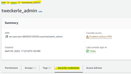

# New User Setup Guide for ZRE Sequencing Data Handling

## How to set up a new user on local server `zymo-hilde01`

### 1. Initial Setup
Ask your IT-Admin to create a new user on `zymo-hilde01`.

### 2. Login
Login via Remote Desktop Connection using this german [guide](Anleitung_Login_Hilde.pdf)

### 3. Install AWS CLI

To install the AWS Command Line Interface (AWS CLI) on Linux (Ubuntu):

1. Open a terminal window.
2. Update the package list to ensure you have the latest information about available packages:
   ```bash
   sudo apt-get update
   ```
3. Install the AWS CLI package:
   ```bash
   sudo apt-get install awscli
   ```
4. Confirm the installation by checking the installed version:
   ```bash
   aws --version
   ```

### 4. Configuring AWS CLI

After installing the AWS CLI, you need to configure it with your AWS credentials and region.

1. Run the following command and follow the prompts:
   ```bash
   aws configure
   ```
2. You will be prompted to enter your AWS Access Key ID, Secret Access Key, default region, and default output format.

#### Getting AWS Credentials

1. Open URL: https://us-east-1.console.aws.amazon.com/iamv2/home?region=eu-central-1#/home
2. Click on "Users"
3. Select your user (e.g., "tweckerle_admin")
4. Click on the tab "Security credentials"



3. After configuring the AWS CLI, you can use commands like `aws s3 ls` to interact with your AWS resources from the terminal.

### 5. Test Upload for ZRE-buckets

1. Open Terminal
2. Run the command below in your terminal:
   ```bash
   time aws s3 cp /media/share/novaseq01/Output/test/speedtests/please_ignore_testfiles_for_speedtest2GB/ s3://testbucket-please-ignore-in-europa/please_ignore_testfiles_for_speedtest --recursive
   ```

### 6. Test Access to ZRC-buckets

1. Open Terminal
2. Run the command below in your terminal:
   ```bash
   time aws s3 cp /media/share/novaseq01/Output/test/speedtests/please_ignore_testfiles_for_speedtest2GB/ s3://zymo-zre-sequencing/please_ignore_testfiles_for_speedtest --recursive
   ```
3. After the test upload has been completed, list the files you uploaded to double check that everything worked:
   ```bash
   aws s3 ls s3://zymo-zre-sequencing/please_ignore_testfiles_for_speedtest --recursive
   ```

### 7. Configure AWS for Better Upload Performance

Run the following command to configure aws to allow more than the default number (10) of concurrent requests to boost upload speed:
```bash
aws configure set default.s3.max_concurrent_requests 50
aws configure set default.s3.max_queue_size 10000
aws configure set default.s3.multipart_threshold 64MB
aws configure set default.s3.multipart_chunksize 16MB
```
